# Wheeled-Robot-Enhancement-and-Practice

> Before you can reproduce these experiments, you must master the following [visualization tool](https://www.guyuehome.com/34172)

This is the coursework for the Zhejiang University Zhu Kezhen College Engineering High School course **Wheeled Robot Enhancement and Practice**, which is mainly divided into the following Labs.


## Running Guide

1. Create a new workspace (in the home directory):

> cd ~
>
> mkdir -p icp_ws/src

2. Put the folder course_agv_icp provided to everyone in the ~/icp_ws/src directory

3. Compile the workspace

> cd ~/icp_ws
>
> catkin_make
>
> source devel/setup.bash

4. Start the corresponding .launch file

> roslaunch course_agv_icp icp.launch

5. Run rosbag

> rosbag play xxx.bag

### Lab 1

Use `socket` to implement simple file sending and receiving

### Lab 2

Running and controlling turtles in the ROS system

### Lab 3  Motion Planning

#### Part 1 Path Planning

Path planning is the process of finding a path from the starting point to the target point in a given environment, taking into account any obstacles or restrictions that may exist (only the geometric constraints of the workspace are considered, not the kinematic constraints of the robot).

Figure 1 Relationship between path planning, obstacle avoidance planning, and trajectory planning

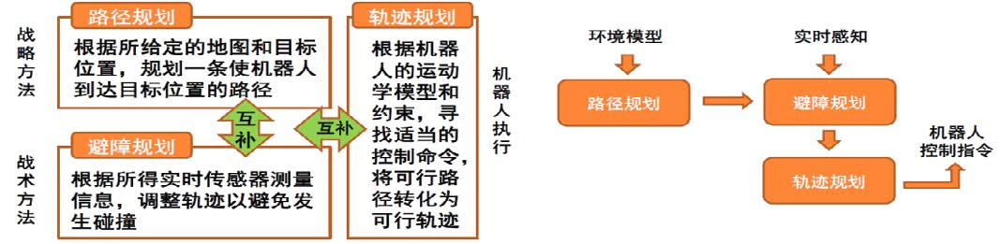

###### RRT algorithm

Take the starting point as the root node of the tree, then randomly sample in the feasible space, find the tree node closest to the sampling point in the tree, generate new nodes and new paths based on the robot's execution ability, add them to the tree based on collision-free detection, and repeat the process until the tree node grows to the key area.

Figure 2 RRT pseudocode and effect diagram

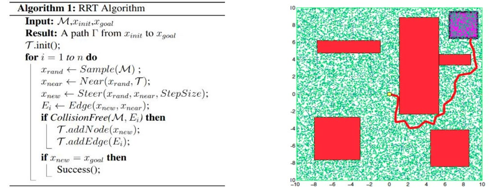

###### AStar algorithm

Based on the breadth-first search defined by priority, according to the heuristic evaluation function:
$$ f(n) = g(n) + h(n) $$

Select the node with the smallest path cost as the next exploration node.

##### Experimental steps

Implement the corresponding algorithms in Astar.py and RRT.py respectively, and then call them in main.py given by the teaching assistant.

##### Difficulties encountered

Mainly appear in parameter adjustment, such as if the expansion is set too large, the car sometimes hits the set obstacles; the speed and acceleration of the car are too large or too small, which is not suitable.

1. The specific implementation of the A* algorithm was not mentioned in class, but since A* is also a commonly used path planning algorithm, I also implemented it.
2. 𝑛 represents a node; 𝑔(𝑛) represents the actual cost from the starting point to the node, that is, the cost in the Dijkstra algorithm; ℎ(𝑛) is the estimated cost of the best path from the node to the target point, that is, the Euclidean distance from the node to the end point.

###### Comparison between RRT and Astar

|                          | RRT                                      | AStar                                          |
| ------------------------ | ---------------------------------------- | ---------------------------------------------- |
| **Algorithm idea**       | Random sampling                          | Heuristic algorithm                            |
| **Time complexity**      | O(n)                                     | O(b^d)                                         |
| **Storage consumption**  | Less                                     | More                                           |
| **Applicable scenarios** | A small number of nodes and known graphs | Complex environment and high-dimensional space |
| ** Python simulation| 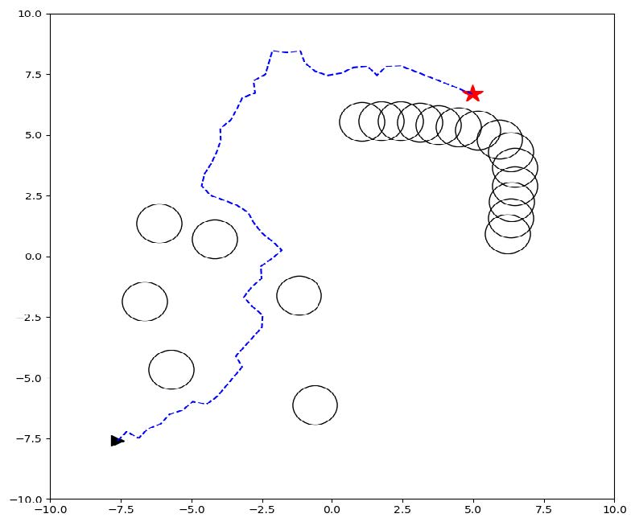 |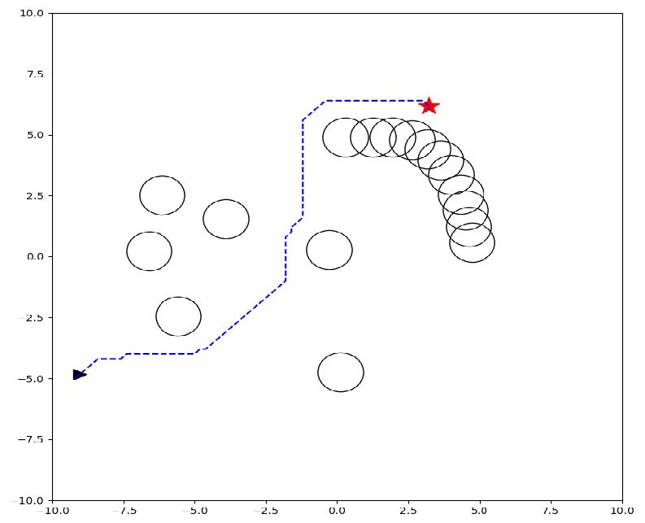   |

#### Part 2 Obstacle avoidance planning

##### DWA algorithm

DWA (Dynamic Window Algorithm), that is, dynamic window method, constructs a feasible speed space based on speed control motion, and selects the optimal speed control instruction in the feasible speed space:

$$ \text{evaluation} = \alpha \cdot \text{heading} + \beta \cdot \text{dist} + \gamma \cdot \text{velocity} $$

- **heading**: Heading towards the target point, ensuring that the robot moves towards the target point.

```python
def heading_cost(self, xf, yf, xt, yt, robot_inf):
angle = np.arctan2((yt - yf),(xt - xf)) - robot_inf[2]
dist = np.sqrt(math.pow((xt - xf), 2) + math.pow((yt - yf), 2))
return 2 * np.abs(angle) + dist
```

- **dist**: Stay away from obstacles, ensuring that the robot avoids obstacles and does not collide safely.

```python
def dist_cost(self, dwa, robot_inf, plan, rad):
dist = 100000
for i in range(int(dwa.predict_time / dwa.dt)):
for obs in plan:
now_dist = np.sqrt(math.pow((obs[0] - robot_inf[0]), 2) + math.pow((obs[1] - robot_inf[1]), 2)) - rad
if now_dist < 0:
return 100000
else:
dist = min(now_dist, dist)
return 1.0 / dist
```

- **velocity**: Maximize the speed to ensure that the robot moves at the maximum speed.

```python
def velocity_cost(self, now_v, max_v):
return max_v - now_v
```

##### Experimental steps

Implement dwaplanner.py, and then call Astar.py (which I used) or RRT.py written in the previous experiment.

##### Difficulties encountered

The main problem still occurs in parameter adjustment, specifically:

1. The car turns too far, and the factors to consider when modifying:

- The radius of the obstacle is too large

- The angular velocity range of the car is too large, and the speed limit is too large

- The predicted point in front of the car is far from the current position

2. When the car is more inclined to reverse or circle rather than bypass the obstacle from the side:

- The obstacle is placed too close to the car

- The angular velocity range given by the car is not large enough

I also realized that Python is a scripting language, so errors will occur when the interpreter cannot understand Chinese comments.

Figure 3 DWA before parameter adjustment & Figure 4 DWA after parameter adjustment and with radar

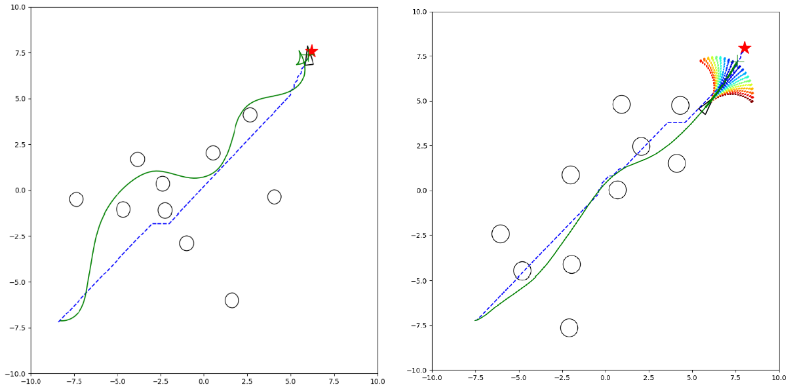

#### Part 3 Trajectory generation and simulation

According to the robot's kinematic model and constraints, find appropriate control commands to convert feasible paths into feasible trajectories in Gazebo and Rviz.

This experiment mainly requires the completion of the two files a_star.py and dwa.py. The parameters in experiments 5 and 6 cannot be directly applied. To match the size of the car, many parameter adjustments are required. Since the corresponding algorithms have been implemented in Astar.py and RRT.py respectively in the previous experiments, a_star.py only needs some parameter changes.

##### File organization

```
└── course_agv_nav
├── CMakeLists.txt
├── config
├── launch
│ ├── nav.launch
│ └── nav.rviz
├── msg
├── package.xml
├── scripts
│ ├── global_planner.py
│ ├── a_star.py
│ ├── local_planner.py
│ └── dwa.py
└── srv
```

##### Difficulties encountered

- **Rollover**: sudden braking and driving, dynamic window opened too large, and reverse range too large.
- **Reduce the reward for obstacle avoidance**, reduce the expansion radius of obstacles. In practice, it will be more effective to reduce the reward function.

Figure 5 Rollover & Figure 6 Turning too large

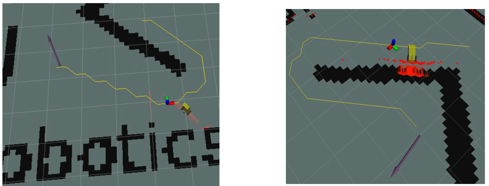

Turning too large means not only that the angular acceleration cannot be too large, but also that the maximum linear velocity cannot be too large; on the other hand, the expansion radius of the obstacle cannot be too large, otherwise it will also lead to a large turning radius, and turning in a small space may not necessarily return to the normal trajectory.

##### Slow calculation speed

Some calculation statements need to be optimized. Calculating a large number of obstacle coordinates will lead to slow code execution and jamming. You can use more operations in the numpy library instead of ordinary operation symbols; at the same time, you can consider only calculating some obstacle points within the robot's field of view to reduce the amount of calculation and memory consumption.

##### Final effect

Figure 7 Trajectory planning simulation under Rviz

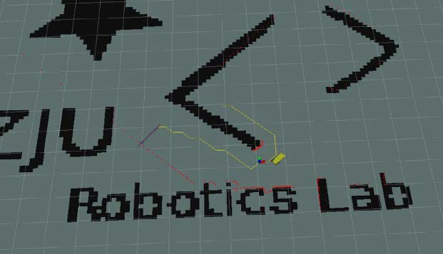

Figure 8 Trajectory planning simulation under Gazebo

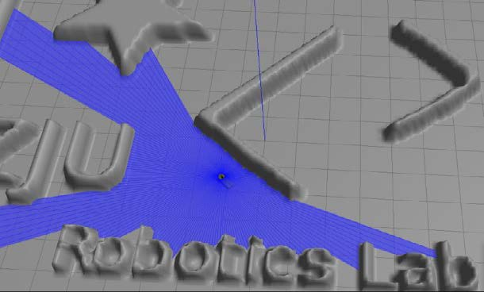

### Lab 4 ICP Algorithm

#### Part 1 Overview

The ICP (Iterative Closest Points) algorithm includes two aspects: corresponding point search and pose solution. The purpose is to find the matching relationship between point sets. The result of the solution is the translation and rotation between the two point sets. In the experiment, the point cloud data set needs to be preprocessed first, the nan type data is removed, and the 3D point cloud data set is converted to 2D. After implementing the ICP algorithm, the bag point cloud data is used for testing, and then the code is deployed to the physical object. The laser sensor data is used instead of the laser data packet to test the degree of overlap between the car's motion trajectory and the ICP estimated trajectory. In this program, positioning is achieved through mileage estimation. By receiving laser data, ICP is calculated to obtain the car's positioning and publish it to TF.

Figure 1 Program operation process and ICP algorithm

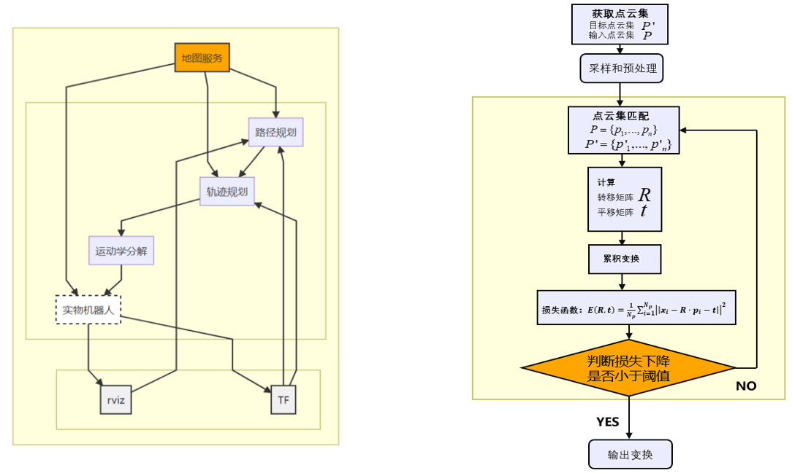

#### Part 2 ICP algorithm optimization

When the program is running, due to the slow running speed and high complexity of the program, it is impossible to input each frame of data into the program in time for processing. Therefore, the algorithm can be improved by reducing the complexity of the program or reducing the amount of input data.

- **Use kd tree instead of double loop**
The original algorithm uses brute force search for nearest neighbor matching, which can be changed to kd tree. The matching complexity of points is reduced from O(N^2) to O(log N). kd tree divides the two dimensions of x and y (or higher dimensions) and performs operations similar to binary search. Once the kd tree is established, it can be used to perform nearest neighbor queries, that is, to find the k nodes closest to a given point.

- **Point cloud key point detection**
The key point values of the point cloud can represent the points of the key information of the point cloud. When the point cloud to be matched is large, their key points are usually extracted first and then matched to reduce the number of matches. Our group used the ISS keypoint algorithm (calling the `compute_iss_keypoints()` function in the library Open3d). The pseudocode and the effect after optimization using this method are shown in Figure 2.

Figure 2 Pseudocode of the ISS algorithm and the change in running time after using the ISS algorithm

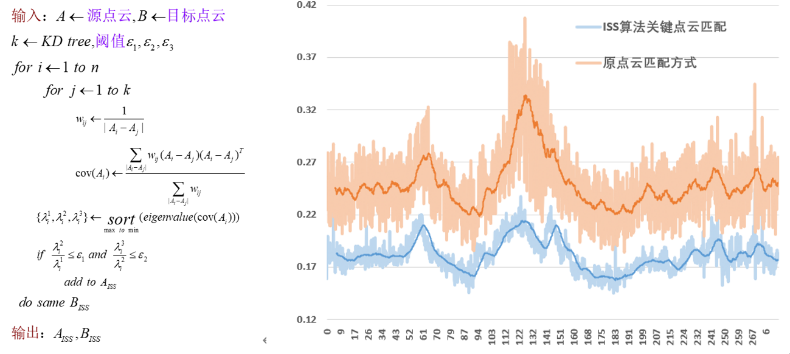

- **Use optimized calculation functions to improve efficiency**
For example, `scipy.distance_matrix(array x, array y)` can speed up the calculation of the distance between point clouds.

#### Part 3 Quantitative analysis of the ICP algorithm

The important evaluation indicators of the ICP algorithm are accuracy and real-time performance. When the algorithm is slow, you can consider reducing the amount of data (here to analyze the complexity), improving the algorithm, or not measuring the displacement of each frame, but skipping a few frames to measure the displacement. But in general, the processing frequency should not be less than the scanning frequency of the radar.

Figure 3 Operation parameter curve before parameter adjustment

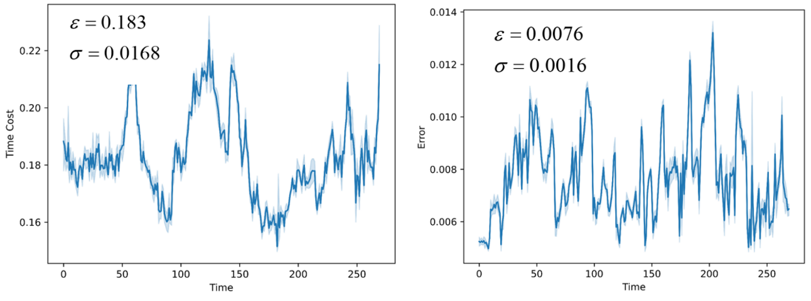

- **Iteration error condition**
When the error between two consecutive iterations is less than `tolerance`, the iteration will stop; reducing `tolerance` can increase the positioning accuracy, and at the same time, the algorithm delay increases due to the increase in the time consumption of each iteration. But in fact, as shown in the figure below, after about 30 iterations, the loss gradient is very small, and `tolerance` needs to be very small to be effective. However, after testing, tolerance does not play a very big role, so you can directly set `tolerance = 0`.

Figure 4 Relationship between loss and iter

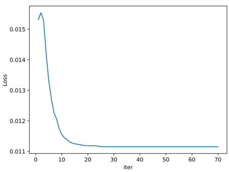

- **Reduce the amount of data**
You can use the method of running frame skipping, corresponding to the parameter `robot_skip` in ICP.launch, and finally choose 2, that is, mod2, which means that only 1/2 of the data is used. Reducing data will lose accuracy, but it can increase the running speed.
You can also use the method of skipping data for matching, corresponding to the parameter `point_skip` in ICP.launch. Skipping some sampling points can slightly increase the running speed, but it will lose a lot of accuracy. After weighing, we finally chose 1, that is, 100% of the data is retained without skipping.

Figure 5 100% of the data volume under 60 iterations

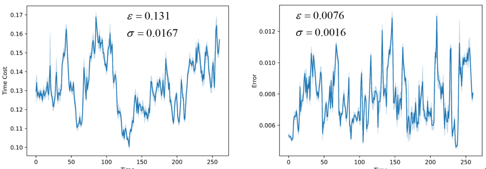

Figure 6 75% of the data volume under 60 iterations

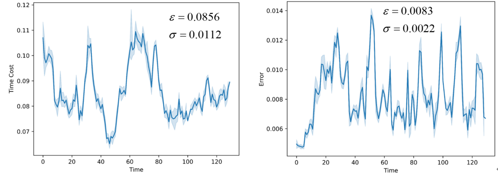

By comparing Figure 3, Figure 5, and Figure 6, we can find that using 75% of the data volume can effectively improve the running speed and real-time performance, at the cost of slightly reduced accuracy, but still within an acceptable range. Therefore, the overall performance is improved, which is consistent with the expected results.

- **Maximum loop**
Corresponding to the parameter `max_iter` in ICP.launch, 70 times were finally selected.
When `tolerance` cannot be reached, if the number of iterations reaches `max_iter`, the iteration will stop.
Increasing `max_iter` will lead to: increased positioning accuracy; increased time consumption for each iteration, which in turn leads to higher algorithm latency. However, there is a tradeoff due to the requirement of real-time performance.

Figure 7 100% of the data volume under 70 iterations, but frame skipping mod2

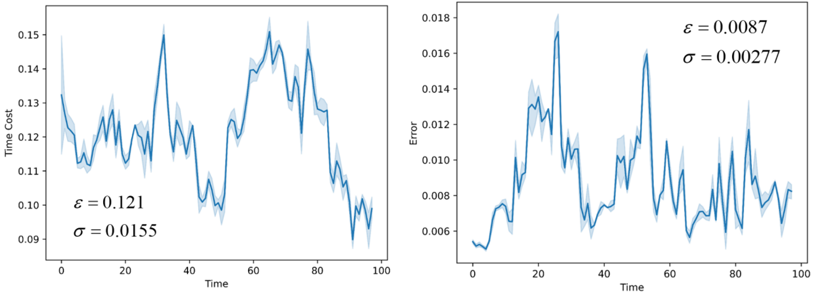

Figure 8 75% of the data volume under 30 iterations

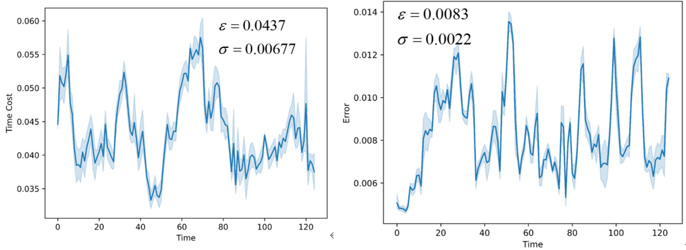

- **Nearest neighbor distance `dis_th`**
In the launch file parameters, `dis_th` describes the distance threshold used to filter matching points. The match is considered successful if the error between the two frames after the transformation does not exceed `dis_th`. Since the transformation between the two frames before and after is small and the algorithm accuracy is high in the actual measurement, the value of `dis_th` has little effect on the algorithm within a certain range. In the above parameters, unless otherwise specified, the default `dis_th` value is 0.05. The figure below shows the impact of the `dis_th` parameter on the accuracy and performance of the algorithm.

Figure 9 30 iterations, 75% data volume, dis_th=0.005

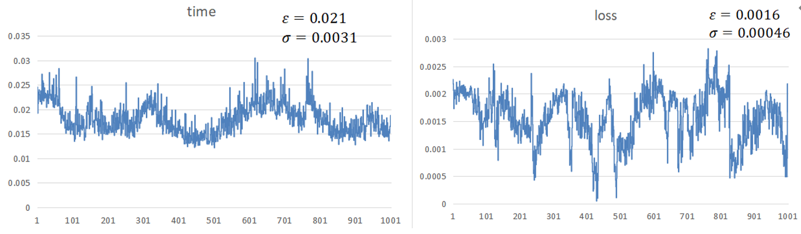

Figure 10 30 iterations, 75% data volume, dis_th=2.0

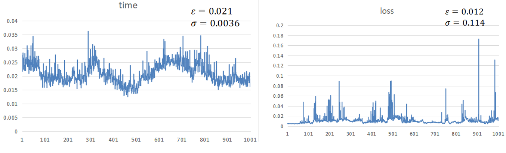

Because the operating environment is inconsistent, the code effect between indicators in the report will be different from other parts, but in the test of a single indicator, we ensure that all parameters are tested on the same machine to eliminate the interference of the operating environment. Since the overall running speed of the algorithm is fast, increasing `dis_th` will only slightly improve the running speed of the algorithm, but reducing `dis_th` can significantly increase the accuracy of the algorithm. After the experiment, 0.05 was selected as the experimental value.
In particular, when `dis_th` is too small (such as less than 0.0001), the algorithm will not be able to match the two frames before and after due to the existence of inherent errors, which will cause the program to stagnate and fail to run (equivalent to infinite running time). Therefore, the influence of this factor should also be considered in the actual value, and `dis_th` should not be reduced excessively for accuracy.

- **Matching error between two frames `loss`**
Consider using `loss` to represent the error between the current frame and the previous frame after matching, and measure the accuracy of the ICP algorithm. In the experiment, `loss` is equivalent to `mean_error`, that is, the total error sum after the current frame of the ICP algorithm matches the previous frame. The image describes the process of `loss` changing with the running time of the algorithm. It is required that `loss` meets:
1) The value is as small as possible;
2) The floating is as small as possible.
The two can be described by the mean and standard deviation respectively.

- **Total calculation time `cost`**
Consider using `cost` to measure the real-time performance of the ICP algorithm. In the experiment, `cost` is equivalent to the execution time of the algorithm each time, which is realized by calling the timer. The image describes the process of `cost` changing with the continuous running of the algorithm. It is required that `cost` meets:
1) The value is as small as possible;
2) The floating is as small as possible.
The two can be described by the mean and standard deviation respectively.

- **Overall analysis**
It can be seen that in our improved algorithm, using 75% of single-frame data can significantly improve the algorithm speed without losing accuracy. At the same time, replacing the double-layer loop with the k-nearest neighbor algorithm can also improve the algorithm speed. In the process of balancing accuracy and calculation time, we found that even if the car does not move, the results of the two most perfect matches will have an error of 0.005. When the car moves, this error will be larger. Then, as long as we observe that the error is close to 0.005, there is no need to further improve the algorithm accuracy. At this time, it can be considered that the algorithm has converged. On this basis, we can greatly improve the algorithm's calculation speed by reducing the number of loops and the number of single matching points without losing too much accuracy. Compared with directly reproducing the original code of the teaching assistant, our algorithm reduces the calculation time to one-fifth of the original while maintaining similar calculation accuracy, from nearly 20ms to 4ms, which can match the laser scanning frequency and greatly improve the real-time performance of the algorithm.
After testing, the best code running parameters are: iter=30 for 30 iterations, 75% of the data volume point_skip=0.75, and the nearest neighbor distance dis_th is 0.05. At this time, the running time for each data packet is measured as:

| Bag File  | 001.bag  | 002.bag  | 003.bag  |
|-----------|----------|----------|----------|
| Run Time  | 2:10:00  | 1:39:00  | 1:48:00  |

#### Part 4 Pitfalls

When reproducing the code on ubuntu18, we found that the calculation speed of the code was slow and the results also had large errors. However, when the same code was ported to ubuntu20 and run with python3, the calculation speed and accuracy of the code were greatly improved. By comparison, we found that it might be due to some errors in the implementation of the k-nearest neighbor algorithm in the sklearn library of python2. This error has been fixed in the sklearn library of python3.

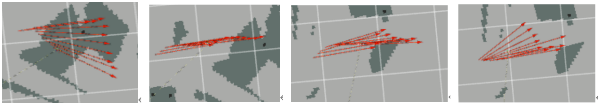

#### Part 5 Keyboard control of the physical car

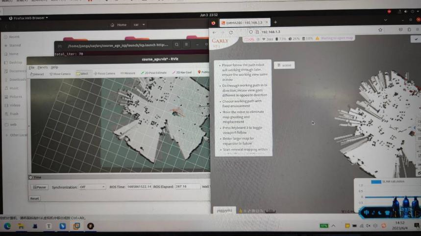
